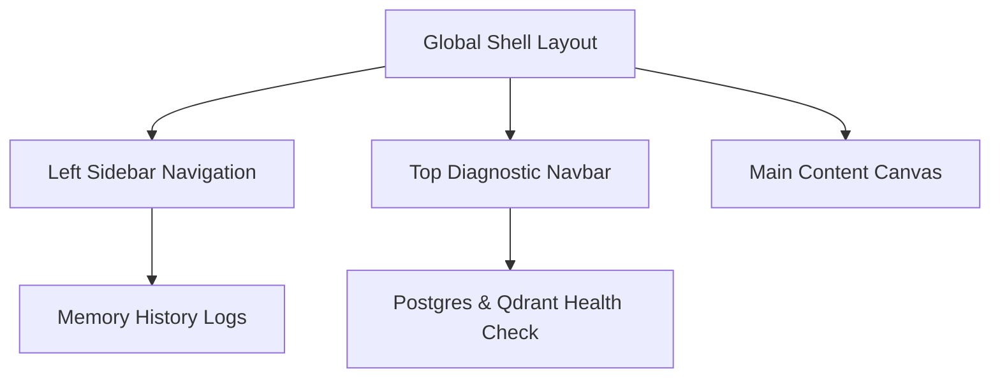
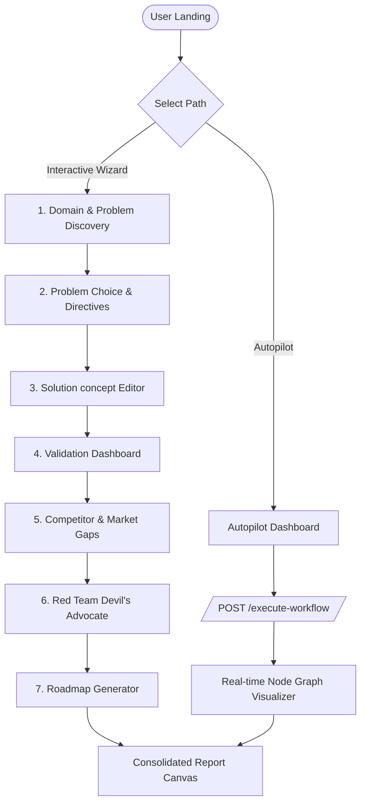

# VentureMind AI — Frontend Specification Document
**Target Platform:** React + Tailwind CSS + Lucide Icons + Recharts + Framer Motion  
**Backend Base URL:** `http://localhost:8000`  
**Aesthetic Vision:** AI-Native Venture Operating System (Premium dark theme, Glassmorphism, Node-graph micro-animations, Real-time telemetry).

---

## 1. Global Architectural & Styling Standards

### 1.1 Color Palette & Design Tokens
The interface must feel like a premium, enterprise-grade AI operating system. Do not use generic plain colors. Implement the following curated palette:
- **Base Background:** Deep space dark (`bg-slate-950` / `#020617`) with subtle radial gradients of indigo/violet.
- **Glassmorphic Surface:** Semi-transparent panels (`bg-slate-900/60 backdrop-blur-md border border-slate-800/80`).
- **Primary Accent:** Electric Indigo (`text-indigo-400`, `bg-indigo-600 hover:bg-indigo-500` / `#6366f1`).
- **Secondary Accent:** Cyber Violet (`text-violet-400`, `bg-violet-600 hover:bg-violet-500` / `#8b5cf6`).
- **Success Verdict (Pass):** Mint Green (`text-emerald-400`, `bg-emerald-500/10` / `#10b981`).
- **Red Team / Warning (Needs Work / Fail):** Hot Crimson / Amber (`text-rose-400`, `bg-rose-500/10` or `text-amber-400`, `bg-amber-500/10`).
- **System Health / Diagnostics:** Tech Cyan (`text-cyan-400`, `bg-cyan-500/10` / `#06b6d4`).

### 1.2 Typography
- **Primary Font:** Inter or Outfit (Google Fonts) for a modern, geometric tech aesthetic.
- **Headers:** Light/Medium tracking-wide, uppercase labels for secondary elements, and crisp bold headers.

### 1.3 Micro-Animations (Framer Motion)
- **State Changes:** Smooth fading (`duration-200`) and scale shifts (`hover:scale-[1.02]`) on cards and buttons.
- **Wizard Transitions:** Slide-in from right on next-step actions; slide-out to left on back actions.
- **List Items:** Staggered entrance animation for dynamically generated cards/lists (e.g., problems, competitors).

---

## 2. Global Layout & Elements

The application implements a persistent shell consisting of a left-hand navigation sidebar, a top diagnostic/command navbar, and a toast-notification overlay.



### 2.1 Left Sidebar (`Sidebar.jsx`)
- **Logo/Brand:** "VentureMind AI" in electric gradient (indigo to violet) with a brain/graph logo.
- **Navigation Menu:**
  1. *Dashboard* (Icon: `LayoutDashboard`, Route: `/`)
  2. *Autonomous Autopilot* (Icon: `Cpu`, Route: `/autopilot`)
  3. *Venture Wizard* (Icon: `Wand2`, Route: `/wizard`)
  4. *Startup Explorer* (Icon: `Database`, Route: `/startups`)
  5. *Competitor Intelligence* (Icon: `Compass`, Route: `/competitors`)
  6. *Market Niche Finder* (Icon: `TrendingUp`, Route: `/market-gaps`)
  7. *Admin Control Room* (Icon: `Settings`, Route: `/admin`)
- **Historical Runs (Memory Context):**
  - Section title: "Active Memory Context" (`GET /api/v1/memory-context`).
  - Renders a list of the last 5 runs showing:
    - Domain (truncated text)
    - Idea title (truncated text)
    - Small color pill indicating the Red Team verdict (`PASS`: Green, `NEEDS_WORK`: Amber, `FAIL`: Rose).
  - Clicking a history item loads that run's state into the application context and navigates to the consolidated report page.

### 2.2 Top Navbar (`Navbar.jsx`)
- **Breadcrumbs:** Shows current active screen (e.g., `Venture Wizard > Problem Discovery`).
- **Telemetry Indicators:**
  - Real-time backend status pill (Calls `GET /api/v1/ml/infrastructure/health` every 30 seconds).
  - If PG and Qdrant are healthy: Shows green glowing dot with "System Online".
  - If any unhealthy: Shows blinking red dot with "Service Degraded" and clicking it triggers a tooltip detailing the health payload.
- **Quick Command Button:** "New Venture Scan" (Navigates to Autopilot selection).

### 2.3 Global Navigation & Back Button Behavior
- **Global Router:** SPA routing using React Router.
- **State Management:** React Context (`VentureContext.jsx`) holding the current active analysis state (`domain`, `problems`, `selectedProblem`, `startupIdea`, `validation`, `competitorData`, `criticFeedback`, `roadmap`).
- **Back Button:** Standard browser back button supported. Wizard stages have explicit "Back to Step X" buttons that preserve user inputs in the Context.

---

## 3. Overall User Flow Map

The platform supports two distinct venture analysis pipelines:



---

## 4. Screen-by-Screen Specifications

### Screen 1: Dashboard & History Center (Landing Page)
- **Path:** `/`
- **Purpose:** Central command center displaying aggregated analytics from previous scans, system logs, and pathways to launch new analyses.
- **API Endpoint:**
  - `GET /api/v1/memory-context` (to retrieve run history)
- **UI Elements:**
  - **Hero Section:** Dark glowing background banner. Text: "Autonomous Venture Intelligence OS". Description: "Analyze domains, discover opportunities, stress-test concepts, and generate roadmaps with a multi-agent orchestration graph."
  - **Quick Start Buttons:**
    - "Launch Autonomous Autopilot" (Primary gradient button, navigates to `/autopilot`).
    - "Step-by-Step Venture Wizard" (Secondary glass border button, navigates to `/wizard`).
  - **Aggregated Stats Panel:** 4 cards:
    - *Total Venture Analyses:* Count of items from memory context.
    - *Highest Viability Grade:* Best grade from history (Scans the grades in memory context).
    - *Active Moats Tracked:* Semantically embedded startups (Calculated from retrieval list length).
    - *System Telemetry:* CPU/Memory health check preview.
  - **Historical Runs Grid:** List of past reports.
    - Renders as cards with: Domain name, Startup Idea, Innovation Score, and Verdict badge.
    - Action: "Open Report" (loads data into Context, routes to `/report`).
- **User Interactions:**
  - Click "Launch Autopilot" -> Routes to `/autopilot`.
  - Click "Step-by-Step Wizard" -> Routes to `/wizard`.
  - Click "Open Report" -> Triggers loading state, sets state in `VentureContext`, routes to `/report`.
- **Loading & Error States:**
  - Grid shows 3 glass skeleton loading cards if history fetch is pending.
  - Error banner shown if `GET /api/v1/memory-context` fails, with a "Retry Connection" button.

---

### Screen 2: Interactive Venture Wizard (Multi-Stage)
A multi-stage wizard navigating the user step-by-step through the multi-agent pipeline. Stage state is cached in the Context so progress is not lost.

#### Stage 2.1: Domain Selection & Problem Discovery
- **Path:** `/wizard/step-1`
- **Purpose:** Select a target domain and invoke the Problem Discovery Agent to uncover 3 venture-scale problems.
- **API Endpoint:**
  - `POST /api/v1/generate-problems`
  - *Request payload:* `{"domain": string}`
- **UI Elements:**
  - **Domain Input Card:** Text input with placeholder "e.g., Healthcare AI, Supply Chain Logistics, Decentralized Energy".
  - **Preset Domain Pills:** Quick-click presets: "Healthcare", "Fintech", "Agtech", "Logistics", "Edtech", "Cybersecurity".
  - **Discover Problems Button:** Indigo button with "Analyze Domain" and a spark icon.
  - **Problems Grid:** (Visible once loaded) Renders 3 cards for generated problems. Each card displays:
    - Title (`title`)
    - Description (`description`)
    - Target Audience (`target_audience`)
    - **Visual Metrics:** Circular gauges or slider bars showing:
      - Impact Score (`impact_score` / 10)
      - Feasibility Score (`feasibility_score` / 10)
    - "Select & Proceed" button inside each card.
- **User Interactions:**
  - Click preset pill -> populates text input with domain.
  - Click "Analyze Domain" -> Disables input, enters loading state, triggers POST request.
  - Click problem card "Select & Proceed" -> Saves selected problem text into Context as `problem_statement`, routes to `/wizard/step-2`.
- **Loading & Error States:**
  - *Loading:* Displays a pulsing scanning card with message: "Problem Discovery Agent analyzing market pain points for [Domain]...". Shows progress indicator at 15%.
  - *Error:* If API returns an error or fails, shows card with warning alert: "Discovery Agent Timeout. Ensure LLM provider key is active." and a "Retry Discovery" button.

---

#### Stage 2.2: Problem Choice & Custom Directives
- **Path:** `/wizard/step-2`
- **Purpose:** Review selected problem statement and add custom directives, audience profiles, or constraints before generating a solution.
- **API Endpoint:**
  - None (Client-side configuration stage).
- **UI Elements:**
  - **Selected Problem Summary Card:** Displays the chosen problem title, description, and target audience in a highlight box.
  - **Configuration Form:**
    - Custom Focus Prompt: TextArea with placeholder "e.g., Focus on a B2B SaaS business model, avoid hardware requirements, prioritize mobile-first interfaces."
    - Target Audience Tweaker: Input to override the target audience.
  - **Next/Back Buttons:**
    - "Back to Problems" (Moves back to step-1).
    - "Generate Startup Solution" (Primary gradient button, routes to step-3).
- **User Interactions:**
  - User can edit/tweak the problem statement text directly in an editable textbox if they want to modify the AI's wording.
  - Click "Generate Startup Solution" -> Saves form settings, routes to `/wizard/step-3` (which automatically triggers the API call).

---

#### Stage 2.3: Solution Generation & Concept Editor
- **Path:** `/wizard/step-3`
- **Purpose:** Invoke the Solution Generator Agent to design a startup concept, view the details, and allow manual edits.
- **API Endpoint:**
  - `POST /api/v1/generate-solution`
  - *Request payload:* `{"problem_statement": string}`
- **UI Elements:**
  - **Concept Dashboard:** Split screen layout.
    - *Left Panel:* Form fields containing generated outputs (fully editable text inputs):
      - Startup Name/Idea (`startup_idea`)
      - Value Proposition (`value_proposition`)
      - Target Audience (`target_audience`)
      - Innovation Summary (`innovation_summary`)
    - *Right Panel:* Key Features list (`key_features` displayed as bullet points, with an "Add Feature" button).
  - **Control Bar:**
    - "Re-generate Concept" (calls API again with original inputs).
    - "Back" (returns to step-2).
    - "Proceed to Startup Validation" (indigo button).
- **User Interactions:**
  - Edits in inputs update the Context state (`startup_idea`, `solution`).
  - Clicking "Add Feature" appends an empty input row in the features list.
  - Click "Proceed to Startup Validation" -> Saves final solution state, routes to `/wizard/step-4`.
- **Loading & Error States:**
  - *Loading:* Pulsing brain graphic with text: "Solution Generator Agent structuring B2B concepts and innovation vectors...". Progress indicator at 35%.
  - *Error:* Warning card with "Failed to generate solution concept" and a retry button.

---

#### Stage 2.4: Startup Validation Dashboard
- **Path:** `/wizard/step-4`
- **Purpose:** Run multi-agent validation on the concept, calculate viability metrics, generate Postgres scores, and view raw weakness analyses.
- **API Endpoints:**
  1. `POST /api/v1/validate-startup`
     - *Request payload:* `{"startup_idea": string}`
     - *Response fields:* `innovation_score`, `market_demand`, `competition_risk`, `feasibility`, `summary`, `weaknesses`
  2. `POST /api/v1/ml/scores/startups` (Calls enhanced score computation/storage)
     - *Request payload:*
       ```json
       {
         "startup_id": "deterministic-uuid-v4",
         "startup_idea": "startup_idea_text",
         "domain": "selected_domain",
         "innovation_score": 8.0,
         "market_demand": 8.5,
         "competition_risk": 4.5,
         "feasibility": 7.8,
         "weaknesses": ["weakness1", "weakness2"]
       }
       ```
     - *Response fields:* `innovation_score`, `market_score`, `competition_score`, `viability_score`, `composite_score`, `grade` (A/B/C/D/F), `summary`, `recommendations`
- **UI Elements:**
  - **Scores Summary Grid (Recharts Dial Chart):**
    - Large circular Gauge chart showing the **Composite Score** (e.g., `8.2 / 10`) with its corresponding letter **Grade Badge** (A, B, C, D, or F) glowing at the center.
    - Grid of 4 card metrics:
      - *Innovation Score* (0-10)
      - *Market Demand Score* (0-10)
      - *Competition Risk* (0-10)
      - *Feasibility / Viability* (0-10)
  - **Weaknesses Panel:** List of strings (`weaknesses`) with exclamation warning icons.
  - **Enriched Recommendations:** List of recommendations computed from scoring service.
  - **Action buttons:**
    - "Back to Concept"
    - "Run Competitor Match & Market Gap Scans" (Primary action, routes to step-5).
- **User Interactions:**
  - Click "Run Competitor Match..." -> Saves validation and PG scoring data to context, routes to `/wizard/step-5`.
- **Loading & Error States:**
  - *Loading:* Circular skeleton spinning ring with text: "Validation Agent calculating market demand and competitive viability...". Progress indicator at 55%.
  - *Error:* Red toast notification alerting: "PostgreSQL database connection refused. Scores could not be persisted." (allowing fallback to view only raw validation scores).

---

#### Stage 2.5: Competitor & Market Gap Analysis
- **Path:** `/wizard/step-5`
- **Purpose:** Analyze competitors and identify market gap scores. Calls vector database (Qdrant) to pull semantic matches.
- **API Endpoints:**
  1. `POST /api/v1/analyze-competitors`
     - *Request payload:* `{"startup_idea": string}`
     - *Response fields:* `competitors` (name, strengths, weaknesses), `market_gaps`, `opportunity_areas`
  2. `POST /api/v1/ml/competitors/analyze` (Semantic enrichment and persistence)
     - *Request payload:*
       ```json
       {
         "startup_id": "uuid",
         "startup_idea": "text",
         "domain": "domain",
         "competitors": [{"name": "competitor1", "strengths": ["s1"], "weaknesses": ["w1"]}],
         "market_gaps": ["gap1"],
         "opportunity_areas": ["opp1"]
       }
       ```
     - *Response fields:* `competitor_count`, `top_competitors`, `market_gap_score`, `opportunity_score`, `semantic_matches` (name, similarity_score, domain, overlap_areas), `recommendations`
- **UI Elements:**
  - **Direct Competitors Table:** Shows discovered competitors, strengths, and weaknesses.
  - **Semantic Overlap (Vector Search Results):** List of similar competitors retrieved from the vector index (`semantic_matches`).
    - Displays competitor name, similarity score percentage (e.g., `89.4% Match`), and tags for overlap areas.
  - **Market Gap Indicator:** Text list of market gaps and opportunity areas.
  - **Strategic Moat Recommendations:** List of strategic moves generated by the ML model.
  - **Action buttons:**
    - "Back to Validation"
    - "Trigger Red Team Critique" (Primary gradient button, routes to step-6).
- **User Interactions:**
  - Click "Trigger Red Team Critique" -> Saves competitor analysis response to Context, routes to `/wizard/step-6`.
- **Loading & Error States:**
  - *Loading:* Shows a spinning compass or sonar animation: "Competitor Agent querying Qdrant vector index for overlapping niches...". Progress at 75%.

---

#### Stage 2.6: Red Team Critique (Devil's Advocate)
- **Path:** `/wizard/step-6`
- **Purpose:** Run the Red-Team Critic agent, performing a adversarial critique of assumptions, displaying critical flaws and the final investment verdict.
- **API Endpoint:**
  - `POST /api/v1/redteam-critique`
  - *Request payload:* `{"startup_idea": string, "validation": dict}`
  - *Response fields:* `critical_flaws` (list), `unrealistic_assumptions` (list), `viability_score` (float), `verdict` (PASS/FAIL/NEEDS_WORK)
- **UI Elements:**
  - **Verdict Card:** Renders a massive, styling-rich card based on the verdict:
    - `PASS`: Bright Green glowing outline, text "INVESTMENT VERDICT: PASS".
    - `NEEDS_WORK`: Orange glowing outline, text "INVESTMENT VERDICT: NEEDS WORK".
    - `FAIL`: Crimson/Rose glowing outline, text "INVESTMENT VERDICT: REJECTED / FAIL".
  - **Flaws & Assumptions Section:** Columns of cards:
    - *Critical Flaws:* (Left column) Lists flaws in rose color with lock/warning icons.
    - *Unrealistic Assumptions:* (Right column) Lists assumptions in amber color with question-mark icons.
  - **Adversarial Viability Meter:** Recharts linear progress bar displaying `viability_score` (0-10).
  - **Action buttons:**
    - "Back to Competitors"
    - "Generate Roadmap" (Primary button, routes to step-7).
- **User Interactions:**
  - Click "Generate Roadmap" -> Saves critic feedback, routes to `/wizard/step-7`.
- **Loading & Error States:**
  - *Loading:* Glowing red alert spinner showing: "Red Team Critic Agent executing devil's advocate review on business assumptions...". Progress at 88%.

---

#### Stage 2.7: Venture Roadmap & Scaling Strategy
- **Path:** `/wizard/step-7`
- **Purpose:** Generate a structured startup roadmap spanning turning the validated idea into a scalable venture.
- **API Endpoint:**
  - `POST /api/v1/generate-roadmap`
  - *Request payload:* `{"startup_idea": string, "solution": dict, "validation": dict}`
  - *Response fields:* `mvp_features` (list), `phase_1` (timeline, goals), `phase_2` (timeline, goals), `phase_3` (timeline, goals), `scaling_strategy` (string)
- **UI Elements:**
  - **MVP Features Moat Card:** Lists core features recommended for the Minimum Viable Product.
  - **Interactive Phase Timeline (Gantt-style representation):**
    - Renders 3 sequential horizontal panels or columns (Phase 1, Phase 2, Phase 3).
    - Each shows: Timeline duration pill (e.g., "Months 1-3"), Stage title, and bullet-point list of milestones/goals.
  - **Scaling Strategy Text Area:** Detailed strategic paragraph.
  - **Action buttons:**
    - "Back to Red Team"
    - "View Final Venture Report" (Primary action, routes to `/report`).
- **User Interactions:**
  - Click "View Final Venture Report" -> finalizes wizard pipeline state, routes to `/report`.
- **Loading & Error States:**
  - *Loading:* Gantt chart skeletons with: "Roadmap Agent formulating milestone schedules and growth strategies...". Progress at 95%.

---

#### Stage 2.8: Consolidated Venture Report
- **Path:** `/report`
- **Purpose:** Full consolidated dashboard view of the generated venture report. Excellent for exports and full review.
- **UI Elements:**
  - **Export Bar:**
    - "Print / Export PDF" (calls `window.print()`).
    - "Export JSON Raw Data" (triggers file download of current Context state).
    - "Index in Startup Database" (calls `POST /api/v1/ml/embeddings/startups` to save it to vector search database).
  - **Tabs Navigation:**
    - `Executive Summary`: Show Startup Idea, Value Proposition, Innovation Summary.
    - `Metrics & Validation`: Shows PG grade, scores radar chart, weaknesses list.
    - `Competitor Landscape`: Discovered competitors table, semantic matches, moats.
    - `Risk Matrix (Red Team)`: Flaws, assumptions, investment verdict.
    - `Execution Roadmap`: MVP scope, 3-phase timeline, scaling strategy.
- **User Interactions:**
  - Click "Index in Startup Database":
    - Triggers API request. Displays checkmark with status: "Successfully embedded and indexed in Qdrant Vector DB!".
  - Switching tabs displays different styled sections.

---

### Screen 3: Auto-Pilot Workflow Screen (LangGraph Viz)
- **Path:** `/autopilot`
- **Purpose:** Provide an automated, single-click scan where the user submits a domain and watches a live node-graph execution trace the agent workflow.
- **API Endpoint:**
  - `POST /api/v1/execute-workflow`
  - *Request payload:* `{"domain": string}`
  - *Response:* The complete combined `VentureState` dictionary.
- **UI Elements:**
  - **Input Panel:** Text input for `domain` and button "Initiate Autopilot Scan".
  - **LangGraph Visualizer Panel:**
    - A stylized node-link diagram representing the LangGraph workflow structure:
      `START` -> `Problem Discovery` -> `Solution Generator` -> `Validation` -> `Competitors` -> `Red Team` -> `Roadmap` -> `Memory Agent` -> `END`.
    - Nodes light up, spin, or pulse in real-time as the frontend simulates/tracks execution stages.
  - **Live Console Terminal:** Displays mock/simulated server logs showing agent handoffs:
    - `[02:14:05] SYSTEM: Compiled orchestration graph successfully.`
    - `[02:14:06] PROBLEM_DISCOVERY: Researching domain gaps in [Domain]...`
    - `[02:14:08] SOLUTION_GENERATOR: Formulating value propositions for discovered problem...`
    - `[02:14:10] VALIDATION_AGENT: Scoring Feasibility and Market Risk...`
- **User Interactions:**
  - Click "Initiate Autopilot Scan" -> Triggers POST request to `/execute-workflow`.
  - Disables inputs, starts terminal stream and node animation.
  - When the promise resolves, it highlights all nodes, updates the console to `[SUCCESS]`, and displays an "Open Consolidated Report" button.
- **Loading & Error States:**
  - Handles network failures by highlighting the active node in red, spitting out traceback errors in the console log, and showing a "Reset Graph" button.

---

### Screen 4: Semantic Startup Explorer (Database Search)
- **Path:** `/startups`
- **Purpose:** Search through the startup database, view semantic relevance ratings, add new profiles, or delete indexes.
- **API Endpoints:**
  1. `POST /api/v1/ml/search/startups` or `POST /api/v1/ml/retrieval/startups`
     - *Request:* `{"query_text": string, "top_k": number, "domain_filter": string|null}`
     - *Response:* List of startups matching query with similarity score, title, domain, target users, and relational Postgres scores if available.
  2. `POST /api/v1/ml/embeddings/startups` (Manual Embedding Tool)
     - *Request:* `StartupEmbedRequest`
  3. `DELETE /api/v1/ml/embeddings/startups/{startup_id}`
- **UI Elements:**
  - **Search Bar & Filters:** Large input field with `Search icon`. Inline dropdown to filter by Domain. Slider to select `top_k` results (1 to 100).
  - **Results Grid:** Renders cards detailing matched startups:
    - Title, Domain, Target Users, Similarity Score Pill (e.g., `Score: 0.914`).
    - Mapped Scores Grid: Feasibility, Innovation, Market scores.
    - Delete button (garbage icon).
  - **Manual Profile Uploader Modal:** (Opens via "Add Startup to Index" button) Form containing fields: Startup ID (generates v4 UUID), Title, Domain, Description, Target Users. Button: "Generate Embedding & Save".
- **User Interactions:**
  - Type query, drag slider -> click "Search". Updates list.
  - Click trash icon -> Displays confirmation modal -> sends DELETE query. On success, removes item from list with transition.
  - Submit Modal Form -> Triggers manual index API -> Closes modal and updates search.

---

### Screen 5: Score History & Side-by-Side Comparison
- **Path:** `/compare`
- **Purpose:** Compare two startup profiles side-by-side on innovation, demand, risk, and feasibility scores.
- **API Endpoints:**
  1. `GET /api/v1/ml/scores/startups/{startup_id}` (Retrieves history)
  2. `POST /api/v1/ml/scores/compare`
     - *Request:* `{"startup_id_a": string, "startup_id_b": string}`
     - *Response:* `{"startup_a": {average_composite_score, latest_grade, latest_composite_score}, "startup_b": {...}, "winner": string, "difference": number}`
- **UI Elements:**
  - **Selector Header:** Two searchable selector dropdowns to pick Startup A and Startup B.
  - **Winner Verdict Banner:** Card showing "Winner: Startup A (Moat Difference: +0.45 Composite Score)".
  - **Radar Chart Panel (Recharts):** Overlaying radar chart displaying Startup A in indigo and Startup B in violet across: Innovation, Market Score, Competition Score, and Viability.
  - **Comparison Table:** Side-by-side values detailing latest scores, historical score counts, and grades.
- **User Interactions:**
  - Selecting two startups in the selectors triggers the comparison request.
  - Clicking a toggle switches the view to a historical line chart showing score evaluations over time for both startups.

---

### Screen 6: Competitor & Niche Market Gap Finder
- **Path:** `/market-gaps`
- **Purpose:** Input a domain, search for similar competitors in Qdrant, and identify underserved niches/market gaps using hybrid confidence ratings.
- **API Endpoints:**
  1. `POST /api/v1/ml/retrieval/competitors`
     - *Request:* `{"startup_idea": string, "domain": string, "top_k": number}`
  2. `POST /api/v1/ml/retrieval/market-gaps`
     - *Request:* `{"domain": string, "top_k": number}`
     - *Response:* List of gaps with `confidence`, `opportunity`, `competition_score`, `signals`
- **UI Elements:**
  - **Input Form:** Domain text input, target `top_k` selector, and "Analyze Gaps" button.
  - **Market Gaps Grid:** Displays opportunity cards containing:
    - Opportunity Title (e.g., "Underserved niche in FinTech AI")
    - Confidence Rating (e.g., `85% Confidence`)
    - Competition Score (e.g., `8.2/10` - indicating low competitive pressure)
    - Signals list tags (e.g., "B2B", "Target Users", "Fragmented Moats")
  - **Competitors Sonar Radar:** A visual circular plot matching similarity scores for discovered competitors.
- **User Interactions:**
  - Enter domain, select top_k -> click "Analyze Gaps".
  - Hovering over a gap card shows the semantic keywords and vector chunk signals that triggered the gap detection.

---

### Screen 7: Admin Control Room & Diagnostics
- **Path:** `/admin`
- **Purpose:** View Postgres/Qdrant health statuses, bootstrap collections, or shut down DB clients.
- **API Endpoints:**
  1. `GET /api/v1/ml/infrastructure/health`
  2. `POST /api/v1/ml/infrastructure/bootstrap`
  3. `POST /api/v1/ml/infrastructure/shutdown?confirm=true`
- **UI Elements:**
  - **Server Status Panel:** Details PostgreSQL connection status (OK/FAIL) and Qdrant collections status (healthy, counts, vector dimensions).
  - **Bootstrap Infrastructure Card:** Description of collections created. Button "Bootstrap Collections" (calls bootstrap API).
  - **Shutdown Operations Card:** Warning card with red alert border. Button "Graceful Shutdown Clients" (calls shutdown API).
- **User Interactions:**
  - Click "Bootstrap Collections" -> Triggers API -> Shows green success message: "Vector collections initialized successfully."
  - Click "Graceful Shutdown Clients" -> Opens double-confirmation modal: "Are you sure? This will disconnect database layers." -> Sends POST query -> Updates Navbar health status indicator to offline state.

---

## 5. UI Components & Interaction Cheat Sheet

| Screen Name | Path | Triggering Endpoint | Key UI Elements | Next Navigation Target |
| :--- | :--- | :--- | :--- | :--- |
| **Dashboard** | `/` | `GET /api/v1/memory-context` | History cards, telemetry badges | `/wizard` or `/autopilot` |
| **Wizard Step 1** | `/wizard/step-1` | `POST /api/v1/generate-problems` | Domain input, problems list, meters | `/wizard/step-2` |
| **Wizard Step 2** | `/wizard/step-2` | *None* | Problem review, directives textarea | `/wizard/step-3` |
| **Wizard Step 3** | `/wizard/step-3` | `POST /api/v1/generate-solution` | Concept forms, editable features list | `/wizard/step-4` |
| **Wizard Step 4** | `/wizard/step-4` | `POST /api/v1/validate-startup`<br>`POST /api/v1/ml/scores/startups` | Composite gauge, weaknesses warnings | `/wizard/step-5` |
| **Wizard Step 5** | `/wizard/step-5` | `POST /api/v1/analyze-competitors`<br>`POST /api/v1/ml/competitors/analyze` | Competitor tables, semantic overlap tags | `/wizard/step-6` |
| **Wizard Step 6** | `/wizard/step-6` | `POST /api/v1/redteam-critique` | Verdict banner, Flaws/Assumptions lists | `/wizard/step-7` |
| **Wizard Step 7** | `/wizard/step-7` | `POST /api/v1/generate-roadmap` | MVP list, Phase timeline panels | `/report` |
| **Consolidated Report** | `/report` | `POST /api/v1/ml/embeddings/startups` | Tab switcher, Export buttons | `/` |
| **Autopilot Scan** | `/autopilot` | `POST /api/v1/execute-workflow` | Graph canvas, live terminal logs | `/report` |
| **Startup Explorer** | `/startups` | `POST /api/v1/ml/retrieval/startups`<br>`DELETE ...` | Filter bars, uploader modal, cards | *None* |
| **Score Compare** | `/compare` | `POST /api/v1/ml/scores/compare` | Dual selectors, Recharts Radar chart | *None* |
| **Market Gaps** | `/market-gaps` | `POST /api/v1/ml/retrieval/market-gaps` | Gaps grid, confidence pills, sonar | *None* |
| **Admin Panel** | `/admin` | `GET .../health`<br>`POST .../bootstrap` | Telemetry panels, bootstrap buttons | *None* |
